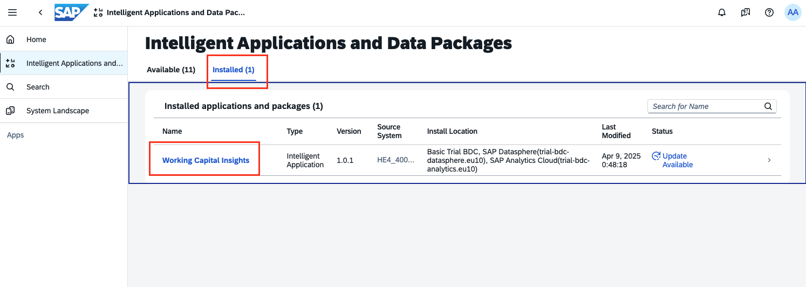
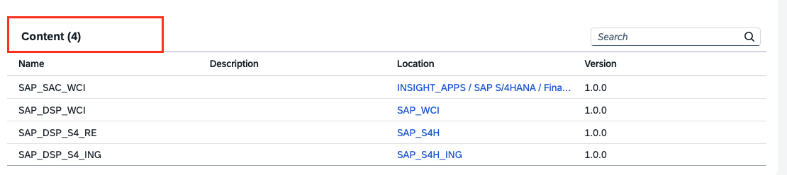

# Exercise 3 - Install Intelligent Applications (30 min)

In this exercise, we will walk through how to install intelligent applications in SAP BDC.

What is an SAP Business Data Cloud Intelligent Application?

SAP Business Data Cloud Intelligent Applications are a suite of adaptive and AI-powered applications that learn from your
data, understand business context, and act on your behalf to transform business outcomes. These are fully managed, built
on a foundation of SAP data products, and incorporate pre-defined metrics, AI models, and planning capabilities,
simplifying how you connect and integrate every part of your business.
They are fully managed applications that are installed through the BDC Cockpit. Once installed, the associated data products, data models, analytics and application assets are deployed and configured automatically. The
prebuilt SAP managed data products installed with the intelligent application packages can then be utilized to build new
insights and develop AI faster.

## Exercise 3.1 Hands-on: Intelligent Application Overview - Working Capital Insights

As an Admin of BDC, installing intelligent applications is a key task you will perform after completing BDC provisioning. In this exercise, let us first locate available intelligent applications, look at the details of one of these intelligent applications called the **Working Capital Insights** so that we can start using the insights and the underlying data products to their full potential.

Following illustration gives an impression of the look and feel of this intelligent application:  
 

1. Log in to your BDC cockpit, using the link and username/password provided.

2. Open the **Intelligent Applications and Data Packages** module in SAP Business Data Cloud. 

3. This module shows the **Working Capital Insights** Intelligent Application has been installed. Go to the Installed tab and click the **Working Capital Insights** Intelligent Application.

This intelligent application is powered by the data from S/4 PCE data products, SAP Datasphere models and SAP Analytics Cloud stories. All of this is comprised in the **Details** section of the intelligent application.

1. Data Products: As shown in the following image, the intelligent application is powered by data from 35 data products, which are highly curated datasets with rich semantic purpose.
 

2. Content:
- SAP_SAC_WCI: SAP Analytics Cloud: The stories that are comprised in this intelligent application will be created in SAC in a folder called SAP_SAC_WCI. You can find this under the Files > Intelligent Applications > SAP S/4HANA > Finance tab. This folder is SAP-managed and will be read-only. 

- SAP_DSP_WCI, SAP_DSP_S4_RE, SAP_DSP_S4_ING: The installation creates and deploys three spaces in the underlying SAP Datasphere. 

    * SAP_WCI - This space contains all the analytic models that form the foundation of the SAC stories.
    * SAP_S4H - This space contains all the modelling artifacts required to build the analytic models, such as views, data access controls etc.
    * SAP_S4H_ING - This space contains all the local tables and their corresponding replication flows. The data from the data products reside in these local tables.   

Clicking the link under the **Location** column will direct you to the corresponding folder.
> [!Note]
> The SAP Datasphere space `SAP_S4H_ING` is a part of an older version of the Intelligent Application. The newest version reuses the Ingestion space that corresponds to the LOB application. 

 

Now you have gone over the basic information of the Working Capital Insights intelligent apps. You can go ahead and install it.

## Exercise 3.2 Guided Tour: Install Intelligent Application - Working Capital Insights

Now that we have checked the details of Working Capital Insights intelligent apps and make sure this is the intelligent app we want to install. In this exercise, let us look at the steps of installing the intelligent application.

Due to the technical and time limitations, we will use guided tours for activities in this class which takes long time and affect the whole shared landscape.

A guided tour is a pre-built, step-by-step interactive walkthrough within a product's demo environment, using tooltips, clear instructions, and highlighted features to lead prospects through key workflows and functionalities. When accessing a guided tour, please click the highlighted area to proceed to the next step.

### Guided Tour
<b>Start the tour [here](https://tour-viewer.platform.saleo.io/adc38a87-3653-488b-9999-a3f05e4b9360). </b> Explanations are provided below to help you understand the exercise.

### Explanations
> [!Note]
> The explanation section is optional reading material. Please feel free to skip this section if the guided tour was sufficient.

1. Locate the **Working Capital Insights** intelligent application, check the details and documentation.

2. In the **Working Capital Insights** homepage, choose the 'Install' button to kick off the installation. A dialog opens up to confirm the installation details. Choose 'Install' again to confirm.

> [!NOTE]
> This saves the related content in an SAP-Managed spaces in SAP Datasphere (DSP) and an SAP-Managed folder in SAP Analytics Cloud (SAC).

> [!IMPORTANT]
> SAP Business Data Cloud uses a singleton SAP Business Data Cloud Cockpit to govern multiple formations. One cockpit can be used to install intelligent applications and packages in different environments, for example, dev, test and prod. Hence, during installation it is asked to specify which source system supplies the data to fuel the intelligent application and which SAP Datasphere & SAP Analytics Cloud constellation is used for the installation. Source System and Install Location must be specified.

3. The status of the installation changes to 'Installing' and then 'Active' when the installation has finished. 

4. After installation you will find **Working Capital Insights** under the Installed Apps and Packages.

> [!NOTE]
> This step can take from several minutes to a few hours, because the step also entails fetching all the underlying data products data into the storage and semantic layer of BDC.

> The system creates three protected SAP Datasphere spaces. It imports connections, replication flows, local tables, views, and analytic models to these spaces, and starts an Initial and Delta load type of the replication flows to keep data fresh in SAP Datasphere.
>The system creates a protected SAP Analytics Cloud workspace, and SAP Analytics Cloud stories, which will be automatically linked to the relevant analytic models in SAP Datasphere.

Now you have sucessfully installed the **Working Capital Insights** intelligent application in your BDC.

### (Optional) Additional Steps after the Installation

If you're new to the BDC, please skip this part to ensure you have enough time to finish the whole class. You can always come back to this later.

After installation is complete, there are a few more steps need to be communicated to the relevant SAP Datasphere and Analytics Cloud administrators, to ensure that the intelligent application is ready to provide data to users. Due to the time limitation we will not dive deeper into the details of this part, please read the followings if you're interested.

1.  SAP Datasphere: Assign newly created scoped roles to users.

In the **Security> Roles** tab, two new scoped roles are created during the installation of the Intelligent Application. The scoped roles have the newly created spaces `SAP_S4H`, `SAP_WCI` and `SAP_S4H_ING` as the scopes. The two newly generated scoped roles are `BDC_Scope_Space_Admin` and `BDC_Scope_Consumer`.
 
 
> [!NOTE]
> The scoped role `BDC_Scope_Consumer` needs to be assigned to the users if they want to see data in the SAP Analytics Cloud story.

In **Space Management**, navigate to each of these spaces and assign users to the two above mentioned scoped roles.
 
 

2. SAP Datasphere: Fill the permission table to maintain data access control.

To maintain Data Access Control for the installed Intelligent Application, open the Data Builder and open the `Central Permissions Table` in the space `SAP_S4H`. You can upload the permissions in the form of a CSV file. For a sample CSV file, please refer to the format [here](other/WciAuthorizationList_set.csv)  
 
 

    - Explanation:
    If the Data Access Control is not properly populated, the users will not be able to see any data (that is, in the data preview in SAP Datasphere, or in Story consumption). Let us take a deeper look into this CSV file. There are 12 rows governing 12 criterion. If five users need access, then the e-mail addresses of all five users must be repeated with each of these 12 criterion. That is, 5*12 rows where the column `User_Id` will contain the user's email address. The names of the columns or criterion cannot be changed and must be uploaded accurately.

3. SAP Datasphere: Run Tasked Chains

On installation, the replication flows fetch the data in the local tables. However, for the data to be populated in the views, the task chains and the corresponding transformation flows need to be run. Before running the task chains, grant yourself access to do so, as follows.
 

In the space, `SAP_S4H`, there are two task chains. Run both task chains as follows:
  - Run task chain sap.s4h.TC_InitWCIConfiguration 
  - Configure the sap.s4h.IL_FinancialDataModelConfiguration table with G/L Account Hierarchy
  - Run task chain sap.s4h.TC_NWCPersis
  - You can find more information [here](https://help.sap.com/docs/business-data-cloud/viewing-insight-apps/2fe6d4074470414585326125c2661428.html)

 
 

The task chain runs can be monitored from the **Data Integration Monitor** > **Task Chains** tab.
 
> [!NOTE]
> If running either of these task chains results in an OutOfMemory exception, refer to the following recommendations. In the **System > Configuration > Workload Management** tab, change the setting of the two spaces `SAP_S4H` and `SAP_S4H_ING` to custom, as shown in the following image.    

To run all the transformation flows, open the space `SAP_S4H` in Data Builder and navigate to the **Flows** tab. There are five transformation flows that have to be run.  
 

Open and run each of the Transformation Flows. 
 

The transformation flow runs can be monitored from the **Data Integration Monitor** > **Flows** tab.
  
 

4. SAP Analytics Cloud: Grant access to content in SAC

Next, we have to manage the access in SAP Analytics Cloud. Open SAP Analytics Cloud using the Product Switch button. In SAC, in the **Security>Users** tab, add all the relevant users who will need access to content in SAC and so that the content can be shared with them.
    
> [!NOTE]
> An admin role, like **BI Admin** or **Admin**, is required to view the Intelligent Applications tab. Hence, for sharing the intelligent application story for the first time, one of these admin roles is required. For subsequent users, the intelligent application can be shared with them as shown in the following steps.
 

From the Managed content folder in the file repository, grant the access rights to all relevant users. Go to Files > Intelligent Applications > SAP S/4HANA > Finance 
 
 

## Exercise 3.3 Guided Tour: Maintain Data Access Control centrally for S/4HANA PCE
Due to the technical and time limitations, we will use guided tours for activities that are one-time. This particular section will go into detail about one of the steps mentioned earlier and explain how to centrally maintain the row level security for one instance of S/4HANA PCE within a formation. It will show you how the data access control is maintained in the S/4HANA reuse space. All the dimensions within `Working Capital Insights` must have the row-level security maintained.

### Guided Tour:
<b>Start the tour [here](https://tour-viewer.platform.saleo.io/b8a59936-3d02-4f1f-a4e9-13b322bfa18d).</b> Explanations are provided below to help you understand the exercise.

### Explanations: 
> [!Note]
> The explanation section is optional reading material. Please feel free to skip this section if the guided tour was sufficient.

All intelligent applications delivered through SAP Business Data Cloud are secured through data access controls. By default, no user can view any data presented in the provided SAP Analytics Cloud stories. To make data available to the users authorized to see it, you must upload your authorizations to the provided permissions table.

When data is delivered to SAP Datasphere through SAP Business Data Cloud, any authorizations that are applied to the data in the source system are not imported.

1. In your preparation space `SAP_S4H`, identify the fact views and the permissions table.
2. Prepare your permissions records in the operator and values format to provide row-level access to the data in your facts.
3. Upload the appropriately formatted operator and values permissions data as a CSV file.
4. You can also maintain permissions data manually using the data editor .
5. Maintain the permissions table as necessary.

## Summary

In Exercise 3, you have gained hands-on experience with SAP Business Data Cloud Intelligent Applications by installing and configuring the Working Capital Insights app. The exercise guided you through reviewing app details, using a guided product tour, installing the app, assigning necessary roles, and maintaining row-level security to secure access to only authorized viewers. By completing these steps, you learned how to manage SAP app installations, data integration, and role assignments to make key analytical features available to your organization.

Continue to - [Exercise 4 - Activate Data Package and Share Data Products ](../ex4/README.md)
