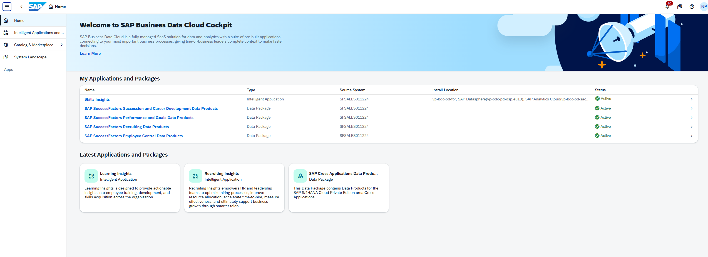
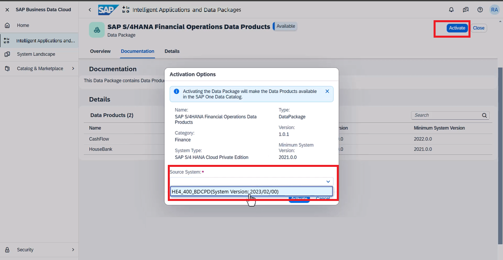
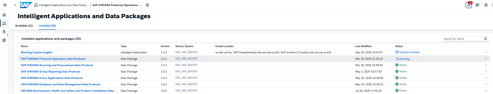
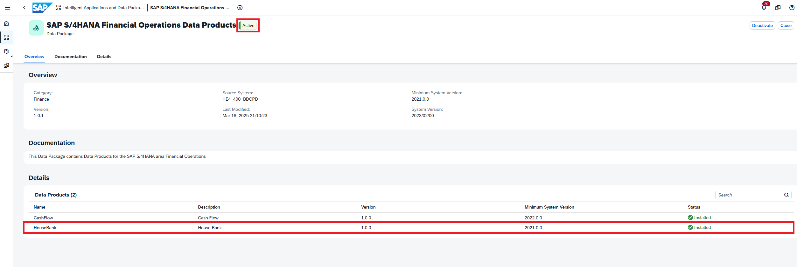
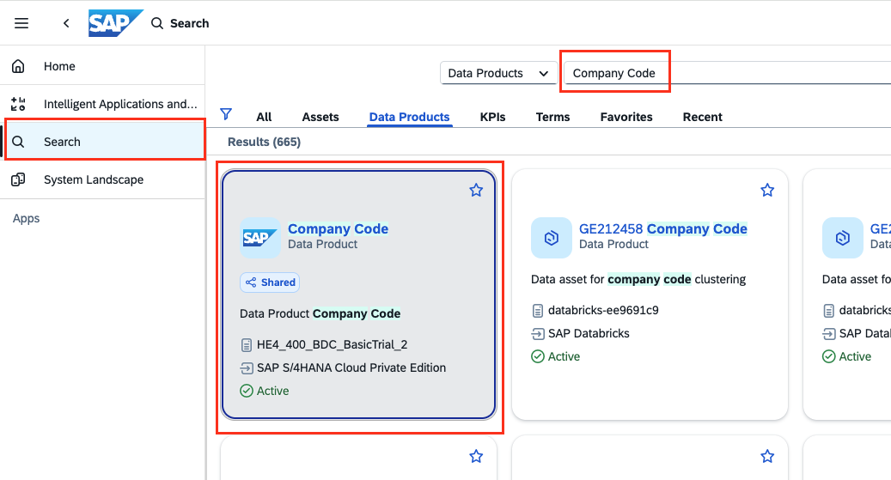
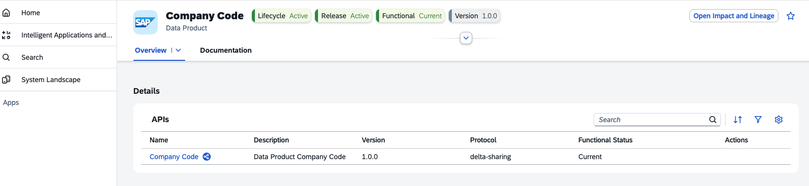

# Exercise 4 - Activate Data Package and Share Data Products (15 min)

In this exercise, you will learn how to activate a Data Package in the SAP Business Data Cloud cockpit and then install the included Data Products in the corresponding SAP Datasphere tenant. But before you do that, let's take a closer look at what a Data Package is and what its key elements are.

### What is a Data Package? 
A Data package contains sets of related data products for use in modelling projects and pro-code applications. All Data packages are available in the SAP Business Data Cloud Cockpit under the **Intelligent Applications and Data Packages**.

The activation of a Data Package in SAP BDC Cockpit is a prerequisite to make it available for business users in the Catalog. The Data Products of this package are visible in the Catalog after this activation. They can be either shared with SAP Databricks for AI/ML use cases or installed in SAP Datasphere which is required for modeling in SAP Datasphere.

## Exercise 4.1 Guided Tour: Activate Data Package

Due to the technical and time limitations, you will use guided tours for activities in this class which takes long time and affect the whole shared landscape.

Guided tour is a pre-built, step-by-step interactive walkthrough within a product's demo environment, using tooltips, clear instructions, and highlighted features to lead prospects through key workflows and functionalities. When accessing a guided tour, please click the highlighted area to proceed to the next step.

### Guided Tour
<b>Start the tour [here](https://tour-viewer.platform.saleo.io/dd7619a5-ef6b-49b6-84d0-f6bac8477db9). </b> Open the guided tour using the context menu and selecting Open link in new tab to stay keep the exercise page open. Explanations are provided below to help you understand the exercise.

### Explanations

> [!Note]
> The explanation section is optional reading material. Please feel free to skip this section if the guided tour was sufficient.

1. Log into the SAP Business Data Cloud Cockpit, open the tab **Intelligent Applications and Data Packages**. This tab shows all the Intelligent Applications and Data Packages that are available for installation.

2. Select the **SAP S/4HANA Financial Operations Data Products** Data package. This data package includes two data products.

3. The overview page provides the following information:

- **Activate**: Activation of a Data Package in SAP BDC Cockpit is a prerequisite to make it available for business users in the Catalog (covered in this exercise). Deactivation can also be performed here which is currently represented in this example. 

- **Category** : categories help in organizing and filtering data efficiently, ensuring that users can easily find relevant information related to specific areas like finance or sales.

- **Version**: Displays the version of the data package.

- **System Type**: Displays the SAP S/4HANA Cloud Private Edition system that provides the business data which populate the data products.

- **Minimum System Version**: This column appears for available data packages only and displays the minimum version of the SAP S/4HANA Cloud Private Edition system required for the data package to be installed. If the current SAP S/4HANA Cloud Private Edition version included in your 'SAP Business Data Cloud' formation is lower than the minimum version required by the data product, the data product cannot be installed.

- **Update**: if there are updates available, they will also be shown at the data package level, and you could trigger an update.

> [!IMPORTANT]
When activating a data package, make sure the source system is correctly identified and accessible. Check that the source system's version meets or exceeds the minimum required by each data product in the package. Data products will only activate if their minimum version requirements are met. For example, if one product requires version 2021 and another requires 2025, and your S4 system is on version 2024, only the product requiring version 2021 will activate. Additionally, the data package itself may have a minimum version requirement; if the source system doesn't meet this, no data products will install. The installation of data products can be partial or full based on the source system's version compatibility.

4. Click on **Activate** to start the installation process. You will be asked to select the source system. Activating the Data Package will make the Data Products available in the Catalog. 

 

5. The status changes to **Activating**. This takes some time depending on the volume of the data in the underlying source system. SAP Business Data Cloud takes care of the data extraction and processing in the background. Once, the activation completes, the Data Products that are comprised in this Data Package are available for consumption.  

6. The Data package and the Data Product comprised in it are now **Active**, if there are updates available, they will also be shown at the data package level, and you could trigger an update. 

## Exercise 4.2 Hands-on and Guided Tour: Share Data Products in BDC Cockpit

Now you have successfully activated the Data Package, it's now available for business users in the catalog. 
Let's assume the data scientist in your org would like to take a look at the "Company Code" Data product in SAP Databricks, play around with the data, see if there is any pattern hidden inside the data. How to help him/her as a SAP BDC Admin?

One can seamlessly share data products to other SAP systems, for example, SAP Databricks, where users can query and enrich them. System administrators in your other SAP systems will then give users authorized access to consume and enrich the shared data products.

To make data products available for consumption in SAP Databricks, you can share data products from the SAP Business Data Cloud catalog to SAP Databricks.

1. Open this link in a **new tab** to access the <b>[SAP BDC Cockpit](https://trial-bdc-core.eu10.hcs.cloud.sap/)</b>, use the username provided to you on the workshop. Use this password: **OblCiHAwov1!**.

2. Open the **Search** module in SAP Business Data Cloud Cockpit, Search for "Company Code" Data Product. Please note there might be many similar data products containing the keywords "Company Code", select the one without any prefix or suffix。
 

3. In the Overview page, we listed important information about this data product. Scroll down to the **Details** Panel, you will find the **Company Code** data product API. Please note this data product has already been shared to you before the training workshop. No action is needed from you.
 

Please check the following guided-tour below to get yourself familiar with the process of sharing.

Guided tour is a pre-built, step-by-step interactive walkthrough within a product's demo environment, using tooltips, clear instructions, and highlighted features to lead prospects through key workflows and functionalities. When accessing a guided tour, please click the highlighted area to proceed to the next step.

### Guided Tour
<b>Start the tour [here](https://tour-viewer.platform.saleo.io/d12091f4-9842-4db1-8203-91ae4f657e38). </b> Open the guided tour using the context menu and selecting Open link in new tab to stay keep the exercise page open.

## Summary

In Exercise 4, you learn how to activate a Data Package in the SAP Business Data Cloud Cockpit. The exercise walks you through identifying key data products, initiating the activation workflow, and understanding how activated data products become available to business users within your organization. By completing the steps, you gain experience managing Data Packages, facilitating data access, and ensuring readiness for business analytics and integration in SAP BDC.

Continue to - [Exercise 5 -  Enhance the Data Product in SAP Databricks and Install Enhanced Data Product in Datasphere ](../ex5/README.md)
