# Exercise 5 - Enhance the Data Product in SAP Databricks and Install the custom-built Data Product in SAP Datasphere (20 min)

At SAP Business Unleashed Event 2025, we announced SAP Databricks, a landmark partnership that brings the power of
Databricks directly into SAP Business Data Cloud.

What is SAP Databricks?

SAP Databricks is an SAP-managed OEM version of the Databricks Data Intelligence Platform embedded natively within
SAP Business Data Cloud. SAP Databricks brings industry-leading AI/ML, data science, and data engineering capabilities
together with semantically rich, business-ready data from SAP applications. 

In Exercise 4, we have shared the **Company Code** Data product from SAP BDC cockpit to SAP Databricks. The Data scientist can further work on this data product in SAP Databricks.
In this exercise, we will simulate the process of exploring the Data Product in SAP Databricks, and install the enhanced data product in datasphere so that data analyst can start their work, for example, modeling, in Datasphere. 

## Exercise 5.1 Hands-on: Enhance the Data Product in Databricks

Let's first do some enhancements on the **Company Code** Data product which was shared previously to SAP Databricks.

1. Log in to your BDC cockpit, using the link and username/password provided. Go to the **System Landscape** tab, locate URL of SAP Databricks, click the URL of Databricks.
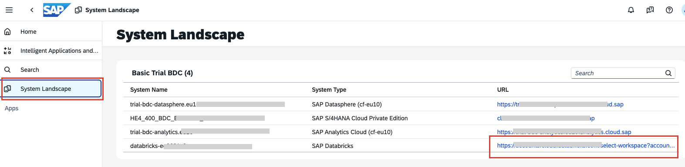 

2. Provide Email and select **Continue**. The email is the yourusername@sapexperienceacademy.com. 

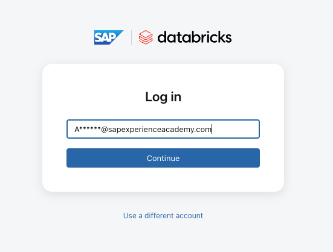 

3. Select **Continue with SSO**.

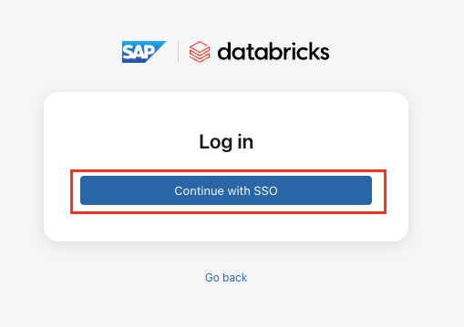 

4. Select the default **workspace** to continue.

 

5. You have entered the welcome page of SAP Databricks. Now let's locate the **CompanyCode** data product which has been shared to you in ex4.

6. Go to **Catalog** tab and locate the **Company Code** Data product as illustrated in the figure below. This Data Product was shared from the SAP Business Data Cloud to SAP Databricks and is now available for consumption. 
 

7. Now the data scientist can start working on this data. Due to the time limitation, we won't include the reprocessing exercise in our session. Instead, we already saved a copy of the enhanced data so that we can continue. Let's expand the catalog again, go to **My organization** and follow the path illustrated below to locate the **company_code_clusters** data:

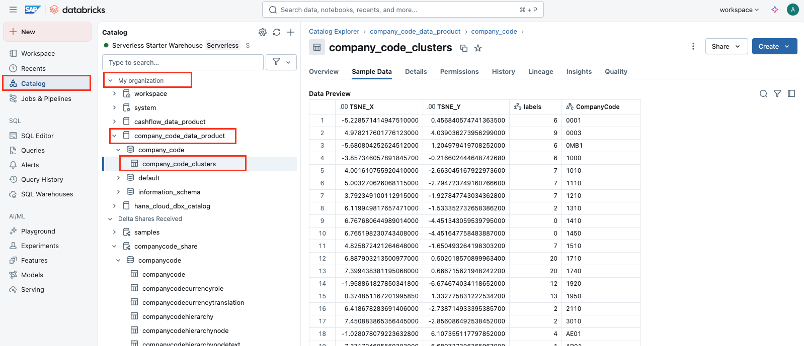 

We enhanced this data product by applying a clustering ML algorithm to the original dataset. The output contains the clustering coordinates and labels for each Company Code.

8. The next step is to share this data via Delta sharing. Select **Share** and choose **Share via Delta Sharing**.

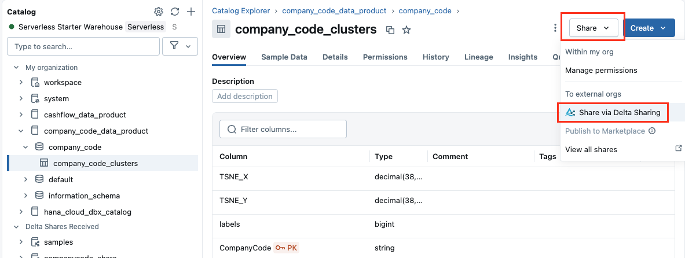 

Select **Create a new share with the table. Provide Share name and Recipients. 
- share name: `company_code_clustering_share_<username>`
- Recipients: `sap-business-data-cloud`

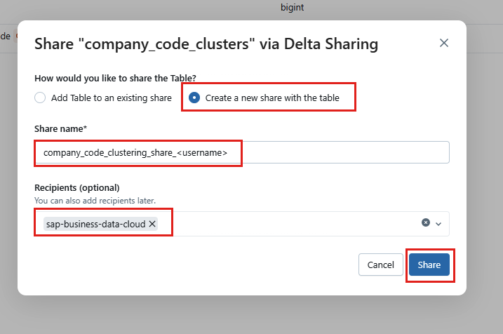 

9. This data product should now be successfully shared to BDC. To confirm all the data products you have shared, select the Gear icon on the catalog and then select Delta Sharing.
 

Switch to **Shared by me** and sort by **created at**, or filter for your username (no space at the end) and select the delta share just created. If you select the delta share you just created, details of this share will be displayed.

 

Congratulations! You have successfully shared the data product created in Databricks to BDC. In order to leverage this data in datasphere, the next step will be install the data product in datasphere.

## Exercise 5.2 Hands-on: Install the Enhanced Data Product in Datasphere

In the previous exercise, we shared your own dataset **company_code_clusters** from databricks to BDC, now it's ready for consume. Before the end user can consume the data, the admin needs to install this enhanced data product in Datasphere to make it available.

>[!Note]
>When you install an intelligent application, the data product contained in that application will be installed in Datasphere. It sets up and deploys entities in an ingestion space or an SAP-managed space. These entities are originally protected by SAP and cannot be editted. In our case, we want to customize the delivered content. We need to transform the SAP-managed content into editable content using the space copy and object sharing. Due to the time limitation, this step has been automated by scripts while setting up your user account in our training system.

>[!IMPORTANT]
> The custom-built data product shared from SAP Databricks requires some time to show up on the SAP Datasphere Catalog. In interest of time, proceed to use the custom data product which was shared ahead of time. The data product is named **company_code_clusters**.

Now, let's try to install the enhanced data product in your Datasphere.

1. Log in to your BDC cockpit, using the link and username/password provided. Go to the **System Landscape** tab, locate URL of SAP Datasphere, click the URL of Datasphere.

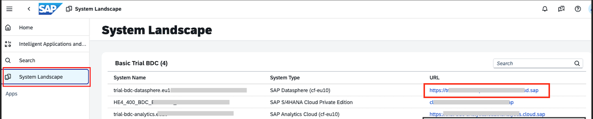 

2. Select Catalog & Marketplace from the side navigation area, then Search.

 

3. Datasphere has provided many useful filters for you to search for your content. Let's select the necessary filters:
- Data Products
- system instance name = `databricks-ee9691c9`

Click the **display as list** in the upper right corner to allow a better view for data products with long name. You can also type in the first few letters of your username to further limit the output. Please note there might be many data products with similar names, carefully select the one match your whole username.

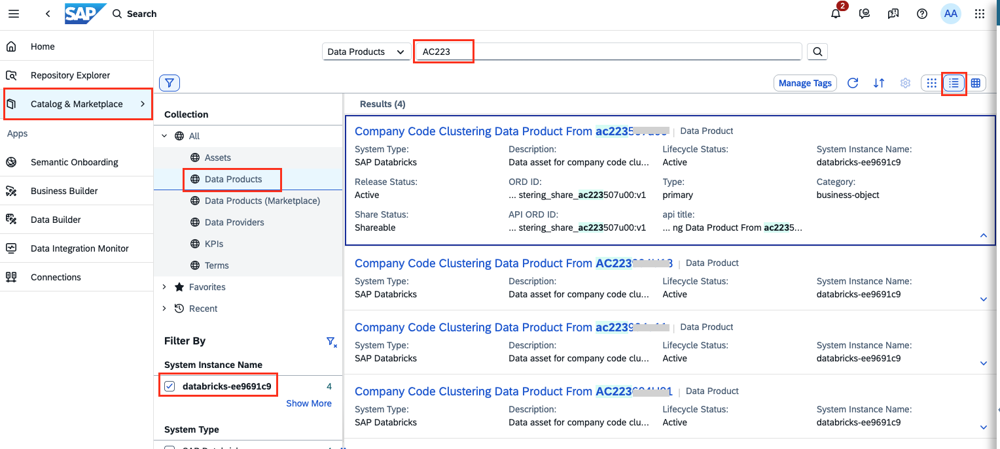 

4. In ex4, we have get familiar with the interface of data product. Now let's go directly to the installation part. Scroll down to the **Details** panel, click **Actions**, then click **install**.

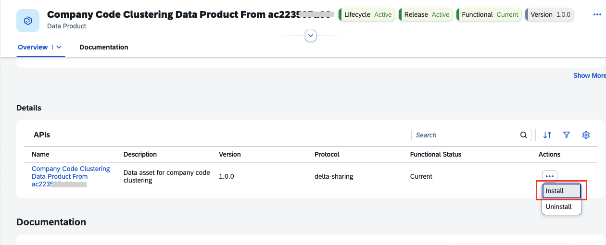 

5. Now you will go through the installation wizard. We have created and shared to you a Datasphere space with your username beforehand, click select it as the target space in the first step:

 

6. Change Data Access method to Remote Tables, and select the company_code_cluster data product, then select Start Import and Deploy.

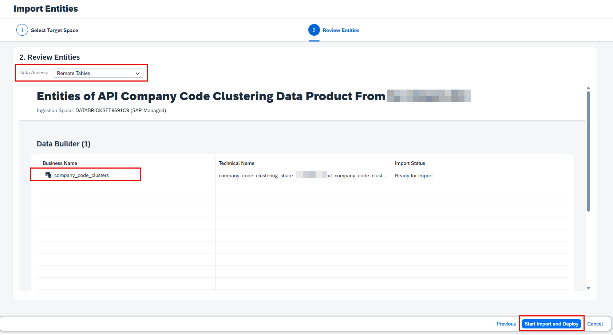 

7. Now this data product has been installed successfully. The new data product is now available in your space. You can go to **Data Builder**, select the space with your user name, the new data product should be the first file in the all files tab.

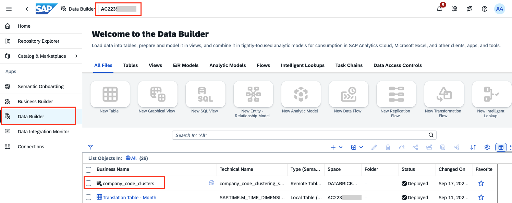 

Congratulations! You can now ask your data analyst to start working on this data product.

## Summary

In Exercise 5, you learned how to share and enhance a Data Product in SAP Business Data Cloud. The exercise guided you through applying a machine learning clustering algorithm, sharing the enhanced Data Product, and installing it in SAP Datasphere. By the end, you were able to verify the Data Product’s availability in Datasphere and enable data analysts to work with the enriched dataset for further analysis and insights.

Continue to - [Exercise 6 - Customization of Intelligent Application - Initiate ](../ex6/README.md)
